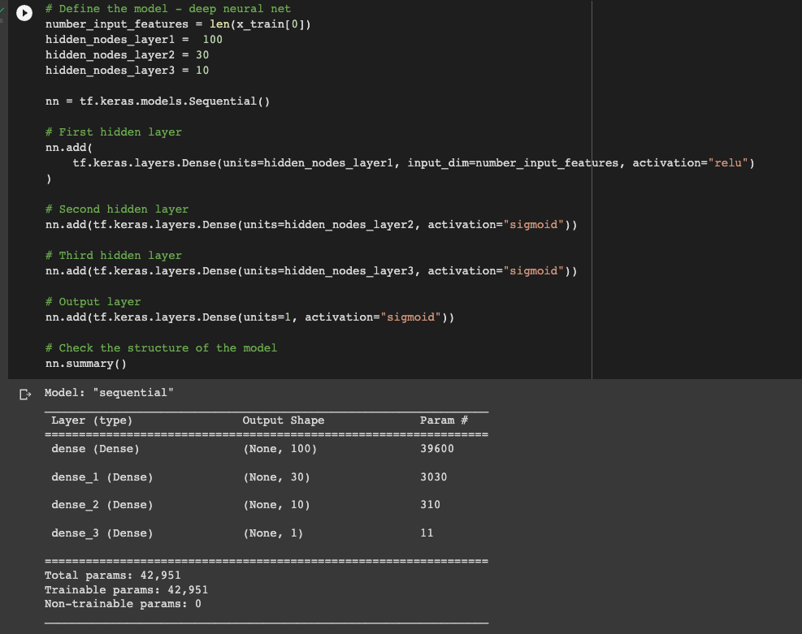
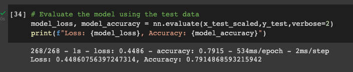

# deep-learning-challenge
Deep learning homework for the GT Data Science Bootcamp!

## Report
After creating and tuning the nn model, here are my takeaways on the model's performance and the tuning process. 
### Overview
This analysis will cover the details of the neural network model created for this challenge. Further, the adjustments made to the model in order to increase performance will be described. 
### Results
#### Data Preprocessing
* The target variable in this model is the "IS_SUCCESSFUL" column. 
* The feature variables in the final model were:
  * NAME
  * APPLICATION_TYPE
  * AFFILIATION
  * CLASSIFICATION
  * USE_CASE
  * ORGANIZATION
  * INCOME_AMT
  * ASK_AMT
* The variables that were removed from the final model were:
  * EIN - just an id number
  * SPECIAL_CONSIDERATIONS - this column had over 34,000 'N' values and only 27 'Y' values. Not helpful. 
  * STATUS - this column had over 34k 1's and only 5 0's - only five of the rows are zeroes which is not helpful. 
#### Compiling, Training, and Evaluating the Model
* The final model had three layers. The first layer had 100 neurons or nodes, the second layer had 30 neurons, and the third layer had 10 neurons. The model used two different activation functions - rectified linear units (relu) and sigmoid. See the image below for details of the model construction. 

* The model exceeded the target performance of 75%. The model reached 79% accuracy - see the image below. 

* I took the following steps to increase the model's performance:
  * Including the NAME column. There were a significant number of organization names that were repeated in the data. I thought there could be a connection betwen the organization and its success. 
  * Two columns, SPECIAL_CONSIDERATIONS and STATUS were removed because they were both almost all one value. 
  * I added a third layer to increase the model's complexity. 
  * I changed the activation functions on the second and third layers as well as the output layer. 

### Summary
The tuned neural network was able to predict outcomes with 79% accuracy. This is a marked increase when compared to the original neural network which predicted outcomes with 73% accuracy. This was achieved by adding the organization NAME to the feature variables, removing SPECIAL_CONSIDERATIONS and STATUS from the feature variables, increasing the model's complexity by adding a third hidden layer, and changing some of the layers' activation functions. 

As an alternative to the nn model, a random forest classifier could be used. I attempted this and was able to get 78% accuracy. This is a much better score than the 75% threshold I was shooting for. However, the neural network won out with 79% accuracy. With further tuning, it may be possible to improve on one or both of these models and get an even better predictive classifier. 
